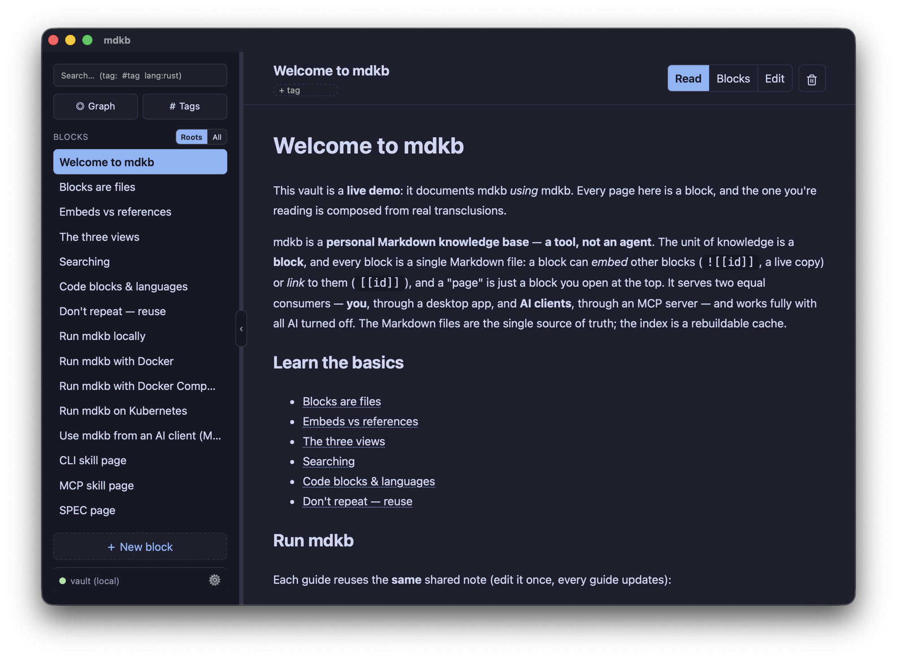
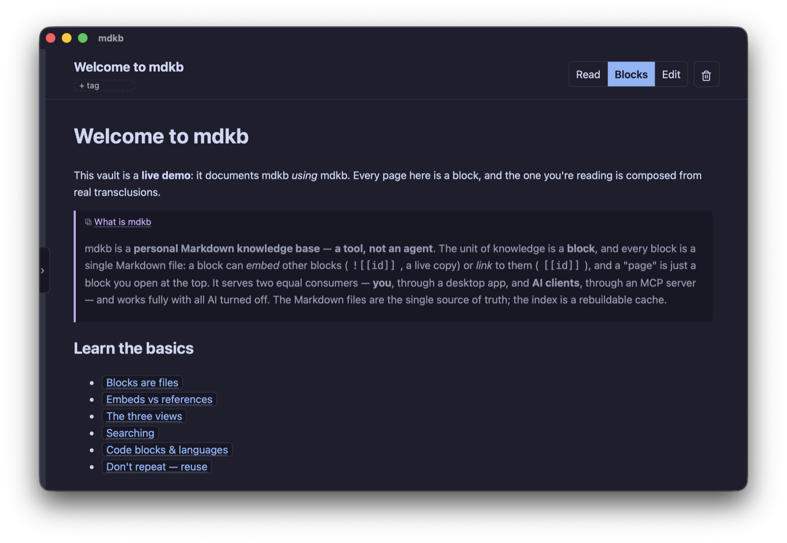
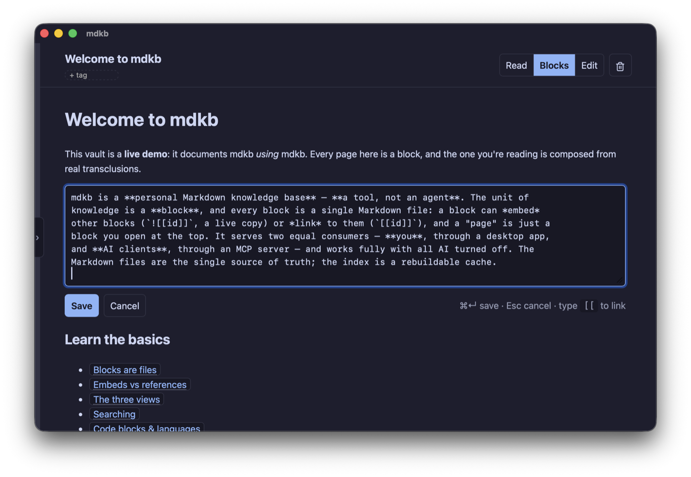
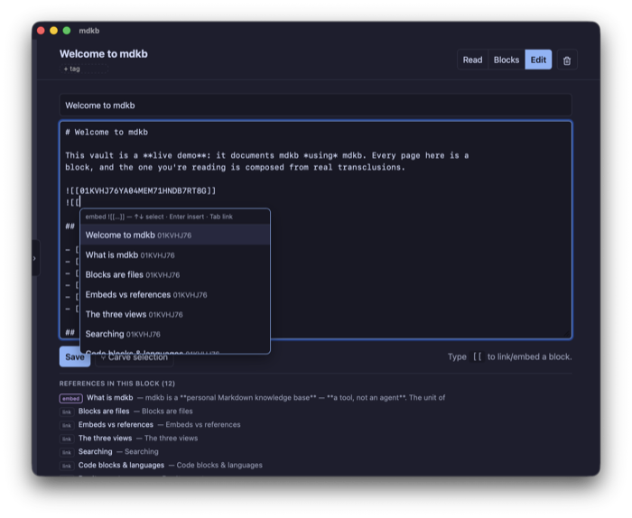
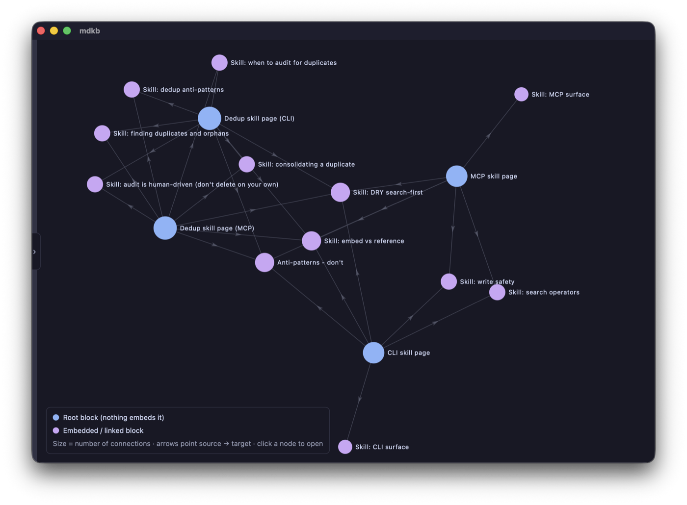
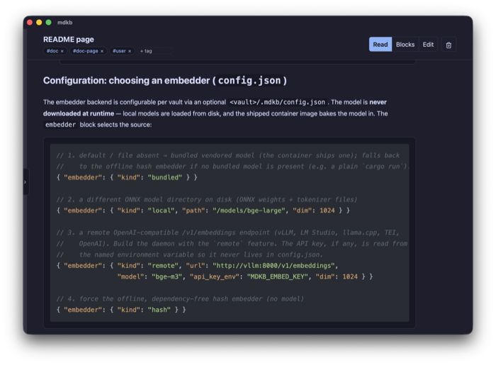
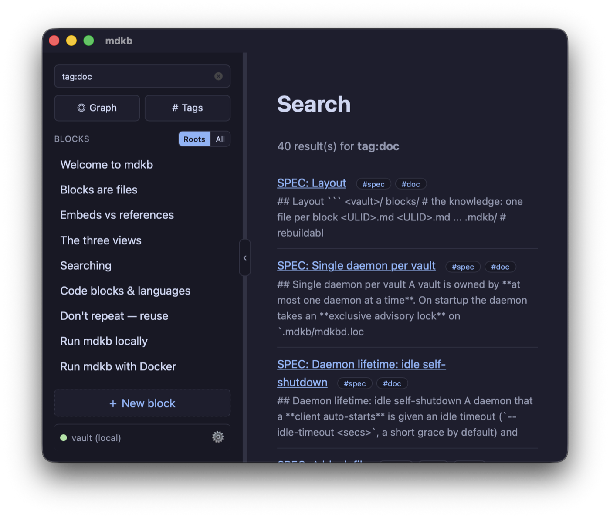

<!-- @generated by mdkb from vault block 01KVKJ1RRAWZ98JYF6VZ3X7DKA (README page).
     Do not edit this file directly — edit the block in the vault and run `mdkb export`. -->

# mdkb — Markdown Knowledge Base

mdkb is a **personal Markdown knowledge base** — **a tool, not an agent**. The unit of
knowledge is a **block**, and every block is a single Markdown file: a block can *embed*
other blocks (`![[id]]`, a live copy) or *link* to them (`[[id]]`), and a "page" is just a
block you open at the top. It serves two equal consumers — **you**, through a desktop app,
and **AI clients**, through an MCP server — and works fully with all AI turned off. The
Markdown files are the single source of truth; the index is a rebuildable cache.

<p align="center">
  <a href="docs/images/app-read.png"></a>
</p>

> Status: core re-architected to the file-per-block model (parser, transclusion, index,
> semantic search, daemon, MCP, web + desktop UIs). Versioned `0.1.0` / pre-release. See
> **[`docs/architecture.md`](./docs/architecture.md)** for the design and
> **[`docs/SPEC.md`](./docs/SPEC.md)** for the exact on-disk format.

## Getting started

### Pick your interface

mdkb is one knowledge base with three front-ends — pick whichever fits the moment. They all
read and write the same vault *through the daemon*, and **you never start the daemon yourself**:
each client auto-starts it on first use and it self-reaps when idle.

| If you want to… | Use | What it is |
|---|---|---|
| Read, edit, and browse the graph | **Desktop app** (or the local **web UI**) | a Markdown editor + knowledge-graph browser |
| Script, search, or pipe from a terminal | **CLI** — `mdkb` | `mdkb search ~/vault "how do I…"` |
| Give an AI assistant your notes | **MCP server** — `mdkb-mcp` | a set of tools your MCP client calls |

Everything works with AI turned off; semantic search is an optional local model (see
*Configuration* below).

### Install: release binary

Download the latest archive for your platform from the **Releases** page and unpack it. Each
archive carries every binary — `mdkb` (CLI), `mdkbd` (daemon), `mdkb-mcp` (MCP server),
`mdkb-web` (web UI) — plus a `model/` directory beside them, so offline semantic search works
out of the box.

```sh
# Linux / macOS (example: macos-arm64 — also published: linux-amd64)
mkdir -p ~/.local/opt/mdkb
tar -xzf mdkb-<version>-macos-arm64.tar.gz -C ~/.local/opt/mdkb
export PATH="$HOME/.local/opt/mdkb:$PATH"     # keep the binaries beside model/
mdkb --help
```

On Windows, download `mdkb-<version>-windows-amd64.zip` (binaries) or the `…-setup.exe`
desktop installer. Keep the binaries together with the `model/` folder — the daemon looks for
`model/` beside its own executable.

### Install: container

Run the daemon as a networked, token-gated service — the image bakes in the embedding model,
so semantic search works offline. Thin clients reach it over TCP with `MDKB_REMOTE` +
`MDKB_TOKEN`.

```sh
# on the host (set a real token; replace <registry>)
docker run -d --name mdkb -p 127.0.0.1:7820:7820 \
  -v ~/mdkb-vault:/vault \
  <registry>/mdkb:latest --vault /vault --listen 0.0.0.0:7820 --token "$MDKB_TOKEN"

# from a client (e.g. the web UI) — connect over the token-gated TCP API
mdkb-web --remote 127.0.0.1:7820 --token "$MDKB_TOKEN"   # http://127.0.0.1:7878
```

See [`deploy/README.md`](./deploy/README.md) for the Kubernetes manifest and full cluster setup.

### Install: from source

Requires Rust (stable); the workspace pins `rust-version = 1.80`. Clone the repo, then run any
interface straight from the source tree — each command auto-starts the daemon:

```sh
cargo build --workspace                          # build everything
cargo run -p mdkb-cli -- list ./my-vault         # CLI
cargo run -p mdkb-web -- --vault ./my-vault      # web UI → http://127.0.0.1:7878
cargo run -p mdkb-mcp -- --vault ./my-vault      # MCP server (stdio)

cargo test --workspace                           # the suite (green before every commit)
```

To install the headless binaries onto your `PATH` (instead of running from the tree), use
`cargo install` from the public mirror — this compiles locally, so on macOS the result is **not**
quarantined and Gatekeeper never blocks it:

```sh
cargo install --git https://github.com/<you>/mdkb mdkbd mdkb-cli mdkb-mcp mdkb-web
# installs: mdkbd (daemon), mdkb (CLI), mdkb-mcp, mdkb-web
```

This default build uses the offline hash embedder; semantic-quality search additionally needs the
vendored model (see the release artifacts) or a local `--features onnx` build with the model files.

The desktop app lives in its own workspace and needs the Tauri toolchain — see
[`app/mdkb-tauri/README.md`](./app/mdkb-tauri/README.md). On macOS, building it from source with
`cargo tauri build` likewise yields an app that opens without the Gatekeeper "damaged" prompt; the
downloaded `.dmg` from a Release is unsigned and needs a one-time `xattr` unquarantine (documented
in that app README).

## Core principles

The design follows from a few rules, each stated once in its own block and reused everywhere:
**Markdown files are the source of truth** and the index is a **rebuildable cache** (above);
**block = file = page** with `![[embed]]` for live reuse and `[[ref]]` for links (the intro and
`docs/SPEC.md`); and **one shared core** behind thin clients (the Contributing rules below).

## Using mdkb

### Command line (`mdkb`)

Every `mdkb` command takes a vault directory and auto-starts (then reuses) that vault's daemon —
the daemon owns the one warm index and is the single writer.

```sh
# reads
mdkb list ~/my-vault                                   # root blocks: id  title
mdkb search ~/my-vault "how do I restart nginx"
mdkb search ~/my-vault kusto --lang=kusto
mdkb search ~/my-vault "ops" --tag=ops --limit=10
mdkb render ~/my-vault <block-id>                      # children inlined
mdkb tags ~/my-vault
mdkb stats ~/my-vault

# writes (body via stdin where shown)
echo "# Note" | mdkb create ~/my-vault --title="Note"  # prints the new id
mdkb set-tags ~/my-vault <id> ops kusto
mdkb link ~/my-vault <src> <dst> --embed
```

Running from source instead? Use `cargo run -p mdkb-cli -- …` in place of `mdkb`.

### From an AI client (MCP)

The MCP server (`mdkb-mcp`) is a thin client of the daemon; point any MCP client at it and it
auto-starts a daemon for the given vault.

```jsonc
// example MCP client config entry
{
  "command": "mdkb-mcp",
  "args": ["--vault", "/path/to/my-vault"]
}
```

For guidance on using mdkb *well* as an AI client — the DRY/transclusion principle, the process
for adding knowledge, and effective search patterns — see the example skill at
[`docs/skills/mdkb-knowledge/SKILL.md`](./docs/skills/mdkb-knowledge/SKILL.md).

### Desktop app & web UI

Two front-ends share the same `mdkb-view` rendering layer (so they can't drift apart), and both
connect either way — a **local** socket or a **remote** TCP daemon.

<table>
  <tr>
    <td align="center"><a href="docs/images/app-block-static.png"></a><br><sub>Blocks — embeds become live cards…</sub></td>
    <td align="center"><a href="docs/images/app-block-edit.png"></a><br><sub>…click any card to edit it inline</sub></td>
    <td align="center"><a href="docs/images/app-edit-picker.png"></a><br><sub>Edit — Markdown + the <code>[[</code> picker</sub></td>
  </tr>
  <tr>
    <td align="center"><a href="docs/images/app-graph.png"></a><br><sub>Graph — nodes sized by link degree</sub></td>
    <td align="center"><a href="docs/images/app-codeblocks.png"></a><br><sub>Code — syntax-highlighted blocks</sub></td>
    <td align="center"><a href="docs/images/app-tag-search.png"></a><br><sub>Search — tag &amp; language filters</sub></td>
  </tr>
</table>

- **Desktop app** (`app/mdkb-tauri`) — a Tauri app over the same crates, and a full **editor and
  graph browser**, not just a viewer. It exposes the same three block modes as the rest of mdkb —
  **Read** (the clean document, embeds dissolved inline), **Blocks** (the working view, each embed
  an editable card), and **Edit** (raw Markdown with the `[[` picker and **Carve selection**).

  On top of those it adds **inline editing** (click rendered content to edit that block in place;
  type `[[` for a link/embed picker), a **"references in this block" legend** under the editor
  (the outgoing links/embeds, each resolved to its target with a preview, click-to-open) and
  **hover previews** on rendered wikilink chips, **New / Add / Carve / Delete** block actions, a
  force-directed **knowledge graph** (nodes sized by link degree, computed in `mdkb-core`
  `link_graph`), **linked references** per block, a **lock toggle** that pins a block as
  **human-only** (🔒 — AI clients can read it but not modify it), and **Settings** (choose a Local
  vault or a Remote daemon `host:port` + token, no env vars; restart the daemon). Point Settings → Local vault at your vault and
  go; see [`app/mdkb-tauri/README.md`](./app/mdkb-tauri/README.md).

- **Local web UI** (`mdkb-web`) — the same views in a browser:

  ```sh
  mdkb-web --vault ~/my-vault                                 # local → http://127.0.0.1:7878
  mdkb-web --remote mdkbd.example:7820 --token "$MDKB_TOKEN"  # a remote daemon
  ```

## Configuration: choosing an embedder (`config.json`)

The embedder backend is configurable per vault via an optional `<vault>/.mdkb/config.json`.
The model is **never downloaded at runtime** — local models are loaded from disk, and the
shipped container image bakes the model in. The `embedder` block selects the source:

```jsonc
// 1. default / file absent → bundled vendored model (the container ships one); falls back
//    to the offline hash embedder if no bundled model is present (e.g. a plain `cargo run`).
{ "embedder": { "kind": "bundled" } }

// 2. a different ONNX model directory on disk (ONNX weights + tokenizer files)
{ "embedder": { "kind": "local", "path": "/models/bge-large", "dim": 1024 } }

// 3. a remote OpenAI-compatible /v1/embeddings endpoint (vLLM, LM Studio, llama.cpp, TEI,
//    OpenAI). Build the daemon with the `remote` feature. The API key, if any, is read from
//    the named environment variable so it never lives in config.json.
{ "embedder": { "kind": "remote", "url": "http://vllm:8000/v1/embeddings",
                "model": "bge-m3", "api_key_env": "MDKB_EMBED_KEY", "dim": 1024 } }

// 4. force the offline, dependency-free hash embedder (no model)
{ "embedder": { "kind": "hash" } }
```

The bundled model directory is resolved from `$MDKB_BUNDLED_MODEL_DIR`, else a `model/`
directory beside the binary. Any misconfiguration (missing model, unreachable endpoint)
logs a warning and falls back to the hash embedder, so the tool always keeps working.
The `onnx` (local models) and `remote` (HTTP endpoint) backends are opt-in cargo features;
default builds pull neither and stay fully offline.

## Deployment

See [`deploy/README.md`](./deploy/README.md). In short: run `mdkbd --vault <dir>` locally,
or deploy the daemon to k3s/Kubernetes as a single writer (`replicas: 1`) serving a
token-gated TCP API (`deploy/k8s.yaml`, `Dockerfile`). Sync only the Markdown vault across
machines; each daemon keeps its own local, rebuildable index.

## Under the hood

Implementation details most users never touch — clients auto-start and self-reap the daemon for
you; the vault Markdown is the only thing you manage.

### How clients reach the daemon

The Markdown vault is the source of truth either way; what changes is *where the daemon runs* and
*how clients reach it*.

- **Local (default).** `mdkbd` owns the vault and a local socket — a **Unix-domain socket** on
  Linux/macOS, a **named pipe** on Windows — and the CLI, MCP server, web UI, and desktop app all
  connect to it. No configuration; clients auto-start it. To work across machines, **sync only the
  Markdown** (OneDrive, etc.) — each machine runs its own daemon and keeps its own local index.
- **Remote / shared.** One `mdkbd` runs centrally (e.g. a `replicas: 1` Deployment in k3s) and
  serves a **token-gated TCP** API. Thin clients connect by setting `MDKB_REMOTE=host:port` and
  `MDKB_TOKEN=<token>`. The daemon stays the single writer; you scale *clients*, not the daemon.
  Network access is opt-in and fails closed without a valid token.

Either way the daemon is the **single writer**: clients never touch `blocks/` files directly, and
the `.mdkb/` index is a rebuildable cache.

### Running the daemon manually

You normally never do this — every client auto-starts and reuses the daemon. Run it yourself
only to keep a vault warm, expose it over the network, or run it as a service:

```sh
mdkbd --vault ~/my-vault            # serves ~/my-vault/.mdkb/mdkbd.sock

# from another shell, clients connect to (or would auto-start) that vault's daemon
mdkb ping  ~/my-vault
mdkb stats ~/my-vault
mdkb search ~/my-vault "restart the web server"
```

By default the offline hash embedder is used (deterministic, no downloads). For real semantic
embeddings from a local ONNX model, the **daemon** owns embedding (clients are thin and need no
embedder). Release builds already include the `onnx` backend and a bundled model; from source,
enable the feature:

```sh
cargo run -p mdkbd --features onnx -- --vault ~/my-vault
```

## Single daemon per vault

A vault is owned by **at most one daemon at a time**. On startup the daemon takes an
**exclusive advisory lock** on `.mdkb/mdkbd.lock` (held for its whole lifetime, released by the
OS on exit — even on crash/kill, so it never goes stale). A second daemon launched for the same
vault fails to take the lock and exits immediately. This guarantees there is never more than one
writer/watcher for a vault, even if the socket file is removed out from under a running daemon.
Clients (UI, MCP, CLI) reuse a live daemon by pinging its socket and only spawn one when none
answers.

## Daemon lifetime: idle self-shutdown

A daemon that a **client auto-starts** is given an idle timeout (`--idle-timeout <secs>`, a short
grace by default) and **reaps itself** once it has been idle that long **and no interactive client
is attached** — freeing its process and embedder RAM so an unused vault doesn't leak a daemon. Any
request (including a liveness ping) defers the timer.

Long-lived interactive clients (the desktop app, the web UI) hold a renewable **lease**: they
heartbeat the daemon periodically, and it will not reap while any lease is active. A lease carries
a TTL and lapses if its client stops heartbeating, so a crashed or closed client can never pin the
daemon open — the lease expires and the idle grace then applies. Momentary clients (the CLI, MCP)
need no lease; their request activity defers the timer as usual.

On reap it removes its socket so the next start is clean; the OS releases the lock on exit. A
daemon a user runs **manually**, or the **remote/shared** daemon, gets no idle timeout and runs
forever. Clients self-heal: if a local daemon has idled out (or crashed), the next interaction
transparently respawns it — at most a brief cold start.

## Workspace layout

| Crate | Kind | Role |
|-------|------|------|
| `crates/mdkb-core` | lib | Shared engine: block model, ids, transclusion, indexing, search. |
| `crates/mdkb-index` | lib | SQLite (FTS5 + sqlite-vec) implementation of the core `Index` trait. |
| `crates/mdkb-embed` | lib | Embedder backends: offline hash embedder + optional local ONNX (`fastembed`). |
| `crates/mdkb-protocol` | lib | Wire protocol: request/response types, blocking client, shared dispatcher. |
| `crates/mdkbd` | bin | Headless daemon: owns the watcher, index, and writes; serves a local socket (Unix socket / Windows named pipe). |
| `crates/mdkb-mcp` | bin (`mdkb-mcp`) | MCP server (stdio); thin client that forwards tool calls to the daemon. |
| `crates/mdkb-cli` | bin (`mdkb`) | CLI for scripting/manual ops, thin client. |
| `crates/mdkb-view` | lib | Shared presentation: Markdown→HTML rendering + page templating for any UI. |
| `crates/mdkb-web` | bin (`mdkb-web`) | Local web UI: thin HTTP server over the daemon + `mdkb-view`. |
| `app/mdkb-tauri` | app | Desktop shell (Tauri); thin client over `mdkb-view` + daemon. *(separate workspace)* |

If a piece of behavior doesn't clearly belong to transport or presentation, it belongs in
`mdkb-core`.

### What each crate/module does

- `mdkb-core`:
  - `id` — `BlockId` (ULID): a block's identity is its filename stem.
  - `blockfile` — parse a block file (`blocks/<ULID>.md`): YAML frontmatter (`title:`, `tags:`)
    + clean Markdown body; collects inline `#tags` and code-fence languages.
  - `block` — the block model (id, title, tags, langs, body) + derived views (children,
    references, contextual text for embeddings).
  - `link` — `[[target]]` / `![[target]]` directive parsing (target = ULID or title, display alias).
  - `vault` — the DAG: a map of `BlockId → Block` loaded from `blocks/`, with id/title
    resolution, children/backlinks, and root detection.
  - `render` — the transclusion resolver: expands `![[id]]` children (the "edit once, reflects
    everywhere" guarantee), renders `[[id]]` as `mdkb:` links, and is **total** — breaks cycles
    and degrades dangling targets locally with a visible note.
  - `index` — storage-agnostic `Index` trait, owned records, search query/hit types, link
    extraction, the knowledge graph, transclusion-reachability, and hybrid ranking (RRF).
  - `sync` — `SyncEngine`: reconciles the `blocks/` directory with an index (hash-skip
    unchanged files, incremental reindex, deletion + conflict-copy detection); owns block
    create/update/delete/carve writes.
- `mdkb-index` — SQLite + FTS5 implementation of `Index` (keyword search, tag/lang filters,
  vector storage, brute-force cosine, hybrid keyword+vector fusion, backlinks, stats). Bundled
  SQLite, no system dependency.
- `mdkb-embed` — `Embedder` backends: the offline deterministic `HashEmbedder` and a bundled
  INT8 ONNX model (no runtime download); configurable per vault.
- `mdkb-core::service` — the shared `Service` API (search / get / render / create / update /
  delete / carve / link / reconcile) with a `RequestContext` + capability gate on every call.
  Every client goes through this; behavior is never reimplemented per client.
- `mdkb-protocol` — newline-delimited JSON wire types, a blocking `Client` (local socket or
  token-gated TCP), the shared `dispatch` handler, and the shared connection layer
  (`ConnectionConfig` / `connect` / `ensure_daemon` — auto-starts a **detached** daemon).
- `mdkbd` — the headless daemon: owns a `SyncEngine` over SQLite + the vault, a `notify` file
  watcher that auto-reconciles external edits, and a local-socket server (Unix socket / Windows
  named pipe). Can also serve a **token-gated TCP** listener (opt-in via `--listen`,
  fail-closed) for remote/cluster clients.
- `mdkb` CLI — a **thin daemon client** (auto-starts `mdkbd` for the vault, then dispatches over
  the socket; reads *and* writes, a full equivalent of the MCP surface). Reads: `list`, `render`,
  `get`, `search`, `tags`, `backlinks`, `links`, `stats`, `conflicts`, `ping`. Writes: `create`,
  `update`, `set-tags`, `link`, `carve`, `flatten`, `delete`. Maintenance: `rebuild`, `export`.
- `mdkb-mcp` — an MCP server (JSON-RPC 2.0 over stdio) exposing the knowledge base as tools
  (`search`, `get_block`, `render_block`, `list_blocks`, `list_roots`, `graph`, `list_tags`,
  `backlinks`, `links_from`, `create_block`, `update_block`, `set_tags`, `delete_block`,
  `carve_block`, `flatten_block`, `link_blocks`, `stats`, `rebuild`, `conflicts`). A thin client that forwards
  every call to the daemon and auto-starts `mdkbd` if needed.

## The vault (`vault/`)

mdkb's own knowledge lives in [`vault/`](./vault) as interlinked blocks — it is the project's
real knowledge base **and** a self-documenting demo: it explains how to use and run mdkb *using*
mdkb. Opening it *is* the tutorial; the run-guides all embed one shared note, so editing that
block once updates every guide (live transclusion). The human-facing docs in this repo are
**generated** from these blocks (see *Docs are generated* below).

```sh
# point the daemon at it (or set the desktop app's Settings → Local vault to this folder)
cargo run -p mdkbd -- --vault vault
```

## Docs are generated (docs-as-data)

Some human-facing docs in this repo are **generated from blocks in `vault/`** — the vault is the
single source of truth, and `mdkb export` renders chosen blocks to flat Markdown. This keeps the
embed-once/reflect-everywhere property for documentation: shared knowledge lives in one block that
several docs transclude.

- `vault/export.toml` maps each generated file to its source block — one `[[doc]]` per file:

  ```toml
  [[doc]]
  path  = "docs/skills/mdkb-knowledge/SKILL.md"
  block = "MCP skill page"
  ```
- Generated files carry a `<!-- @generated by mdkb … -->` banner — **don't hand-edit them**;
  edit the source block in `vault/` and re-run export.
- Regenerate everything, or check for drift (CI/pre-commit gate, non-zero exit on drift):

```sh
cargo run -p mdkb-cli -- export vault            # regenerate the mapped docs
cargo run -p mdkb-cli -- export vault --check    # verify they're current
```

There are three ways to select what to export:

- **A manifest** (`vault/export.toml`, or `--manifest=<path>`) — a TOML list of `[[doc]]` entries,
  each pairing an output `path` with the `block` (ULID or title) that fills it. An optional
  `[defaults]` table sets the banner policy for every doc (`raw = true|false`); a per-entry `raw`
  overrides it. A manifest entry is the on-disk twin of the options an export command computes —
  *one command ≈ one `[[doc]]`*. A `--manifest=<path>.json` file with the same schema also works.
- **`--tag=<name>`** — export the **root** blocks carrying that tag to `<slug>.md` (under `--root`,
  default `docs-export/`). A page is just a root, so `--tag=doc` exports the pages tagged `doc`
  without also emitting their transcluded section blocks. Add `--include-non-root` for *every*
  block with the tag.
- **No selector** — dump every root block to `<slug>.md` (the whole-KB case).

`--raw` omits the `@generated` banner; `--check` writes nothing and exits non-zero on drift (the
CI/pre-commit gate). Within a single export, co-exported docs **cross-link** (a `[[reference]]`
between them becomes a relative link); a reference to a block outside the export degrades to plain
text and prints a `warning:` — unless **`--follow-links`** pulls the linked block into the export.

The CLI/MCP skills, **[`docs/SPEC.md`](./docs/SPEC.md)**, **[`AGENTS.md`](./AGENTS.md)**, and this
README are all generated from blocks in the vault.

## Roadmap

- **Phase 0 — Scaffold** *(done)*: workspace, crates, governance docs.
- **Phase 1 — Core SSOT (no AI)** *(done)*: Markdown parser, block model (incl. code-fence
  `lang`), eager block-id assignment, transclusion/reference resolver, `#tag` + frontmatter
  extraction, CLI render.
- **Phase 2 — Index + watcher** *(done)*: SQLite (FTS5) index, keyword + tag/lang-filtered
  search, `SyncEngine` reconcile. *(Live `notify` event loop lands with the daemon.)*
- **Phase 3 — Semantic search** *(done)*: local embeddings (`mdkb-embed`: offline hash +
  optional `fastembed` ONNX), vector storage, hybrid keyword+vector ranking.
- **Phase 4 — Daemon + API** *(done)*: shared `Service` API + `RequestContext`, JSON wire
  protocol, `mdkbd` with a local-socket server and `notify` file watcher.
- **Phase 5 — MCP server** *(done)*: `mdkb-mcp` exposes search / get / render / upsert /
  link / stats as MCP tools over stdio; thin client of the daemon.
- **Phase 6 — Frontends** *(done)*: shared `mdkb-view` (Markdown→HTML), runnable
  `mdkb-web` local UI, and a `app/mdkb-tauri` desktop shell over the same view layer.
- **Phase 7 — Sync UX & packaging** *(done)*: cloud-sync conflict detection (surfaced, not
  indexed), index `rebuild`, token-gated TCP transport for cluster deploy, Dockerfile + k8s
  manifest + example MCP config (`deploy/`).

### Follow-ups / known gaps

- **Windows desktop app — observability** *(planned)*: the Tauri shell runs in the Windows
  `windows` subsystem (no console), and its diagnostics are best-effort stderr writes that go
  nowhere in a GUI launch. `tauri::Builder::run()` still ends in `.expect(...)`, so a genuine
  WebView2 init failure would panic **silently and undiagnosably**. Add structured logging to
  a rolling file in the app-data dir (`tracing` + `tracing-subscriber` + `tracing-appender`),
  install a panic hook that records to the same log, and replace the `.expect` with a logged
  graceful exit.
  - *Investigation note:* a "window flashes then disappears" symptom on Windows was reproduced
    only by a pathological harness (force-killing the app + daemon + webview every ~2s, which
    races the shared WebView2 profile lock at `%LOCALAPPDATA%\dev.mdkb.desktop\EBWebView`).
    Normal launches, and relaunch-after-crash, were reliable in testing. The file log above is
    what would let us confirm/deny this in the wild rather than theorize.
- **Knowledge graph — distinguish transclusions from references** *(planned)*: the graph
  currently collapses `[[refs]]` and `![[transclusions]]` into one undifferentiated edge type.
  Tag each edge with its kind in `mdkb-core` (`link_graph`) so the two are distinguishable in
  the data, then render them differently in the UI (e.g. solid edges for `![[transclusions]]`,
  dashed for `[[refs]]`) so a reused/embedded block reads visibly different from a plain link.
- **Desktop app — light theme** *(planned)*: the app currently ships a single dark theme. Add a
  light theme and a theme toggle (follow the OS appearance by default), so the editor, graph, and
  block cards read well on a light background. Until then, the README screenshots are dark-only.

## License

Dual-licensed under MIT or Apache-2.0.

## Contributing

These rules are mandatory; the canonical copy is **[`AGENTS.md`](./AGENTS.md)**, generated from
the **same blocks** embedded below — so editing a rule once updates both.

### Tests are mandatory

- Every behavior change ships with tests in the **same change**. No "I'll add tests later."
- New modules with logic are not "done" until they have unit tests covering the happy path
  **and** the meaningful edge cases.
- Bug fixes start by adding a test that reproduces the bug, then fixing it.

### Always run the full suite before every commit — and it must be green

- Run **`cargo test --workspace`** before *every* commit. Zero failures, zero ignored-without-reason.
- Never commit with a red or skipped suite. If a test is legitimately pending, it is the
  task — don't commit around it.

### Docs are data — edit the block, regenerate; never hand-edit a generated file

- Some human-facing docs are **generated from blocks in `vault/`** via `mdkb export` (the
  mapping is `vault/export.toml`). Generated files carry a `<!-- @generated by mdkb … -->` banner.
- **Never hand-edit a generated file.** To change its content, edit the **source block** in
  `vault/` (via the app, the `mdkb` CLI, or MCP), then run `mdkb export vault` and commit the
  regenerated file(s) in the **same** change.
- `mdkb export vault --check` must pass before every commit — it writes nothing and exits
  non-zero on drift. CI runs it inside the Docker `tester` stage — on **every push to `main`**
  (the `Build and Release` workflow) **and every pull request** (the `PR Check` workflow, which
  invokes the same `--target tester` stage so the two gates can't drift) — so a block edited
  without re-exporting, or a generated file edited by hand, fails the build.
- Docs **not yet** migrated into the vault remain hand-maintained and must reflect the current
  state at commit time; when one is promoted into `vault/`, it becomes generated and this rule
  applies to it.

### Do not duplicate code — always look for reuse

- Before writing new logic, search for an existing implementation to call or extend.
- If the same logic is needed in two places, **extract it into `mdkb-core`** (or a shared
  module) and call it from both. Copy-paste of logic is a defect.
- Prefer extending a shared function over forking a near-duplicate.

### One shared core — the UI and the MCP server must never diverge ⚠️ critical

- **All** behavior that touches blocks, transclusion, indexing, search, parsing, or writes
  **MUST** live in `mdkb-core` and be invoked through the daemon/core API.
- The **MCP server, the Tauri UI, the web UI, and the CLI are thin clients.** They contain
  presentation and transport glue only — **never** a second copy of core behavior.
- Rationale: if the same surface is implemented twice, a bug can be fixed in one and left
  broken in the other. A bug fixed once must be fixed everywhere. If you find yourself about
  to implement the same thing in two clients, **stop** and put it in core.
- When you add a capability, expose it from core first, then wire the clients to that single
  entry point.

### Keep the seams clean

- Pluggable boundaries are traits (`Index`, `Embedder`, `IdCodec`, transport). Program to the
  trait, not the concrete type, so engines/encodings can be swapped without touching callers.
- Don't leak storage/encoding details past their trait boundary.

### Pre-commit checklist (run top to bottom)

1. `cargo fmt --all` — code is formatted.
2. `cargo clippy --workspace --all-targets -- -D warnings` — no lints.
3. `cargo test --workspace` — **all green**.
4. `mdkb export vault --check` passes; generated docs were regenerated (edit the block, not the
   file). Any not-yet-generated docs updated to match the current state.
5. New/changed logic has tests committed alongside it.
6. No duplicated logic; shared behavior lives in `mdkb-core`.
7. Commit message explains the *why*, not just the *what*.

Only commit when **all** boxes are satisfied.

### Commit hygiene

- Small, focused commits. One logical change each.
- Never commit secrets, the local `.mdkb/` index, or `/target`.
- The vault's Markdown is the source of truth; the index is always rebuildable — never treat
  the index as authoritative in code.
