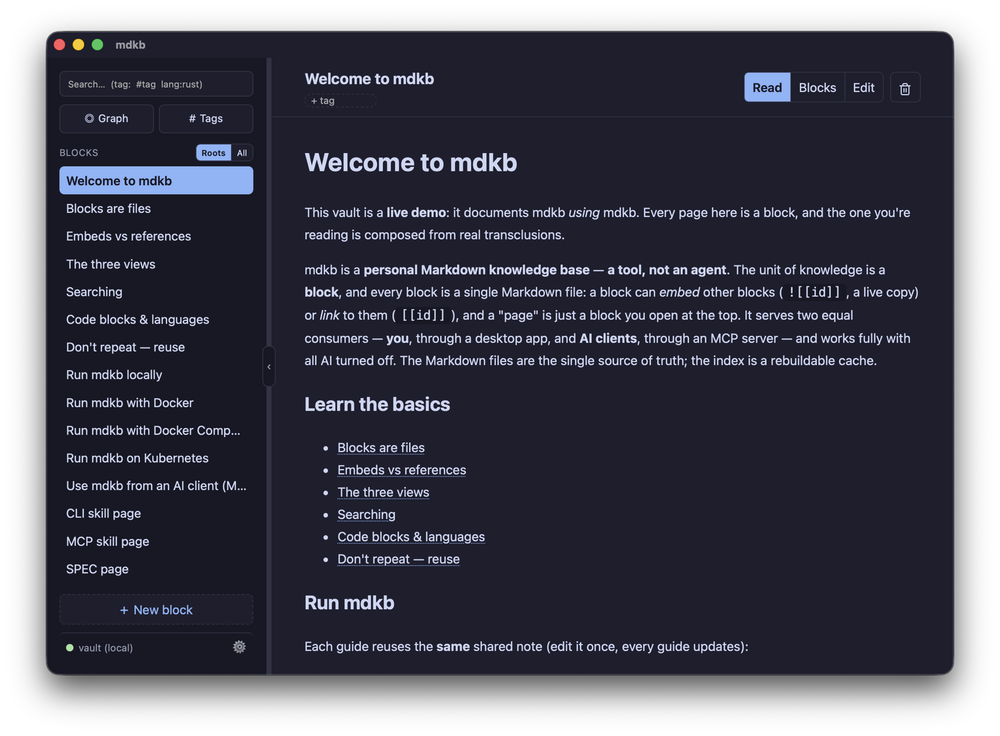
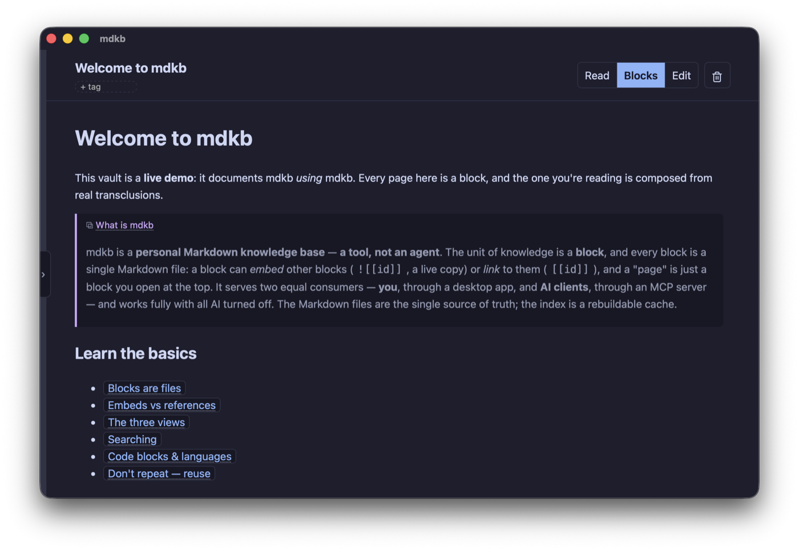
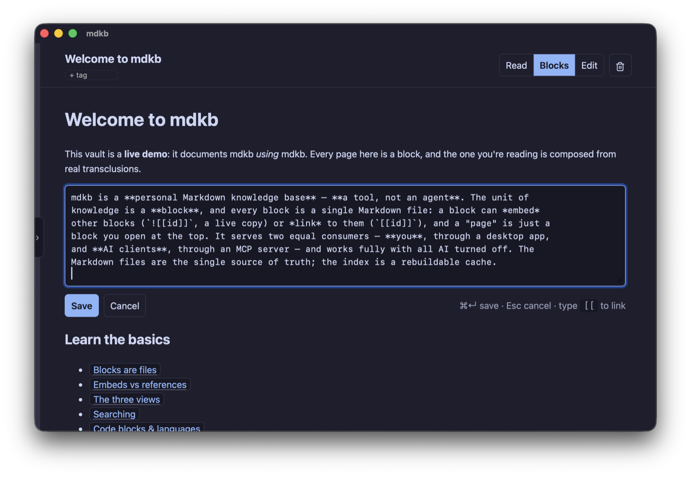
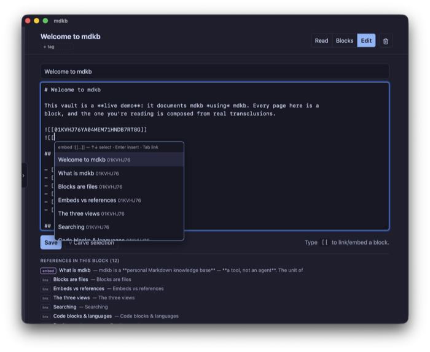
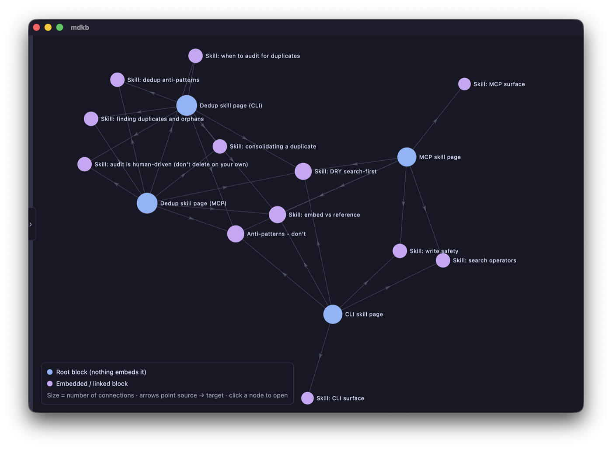
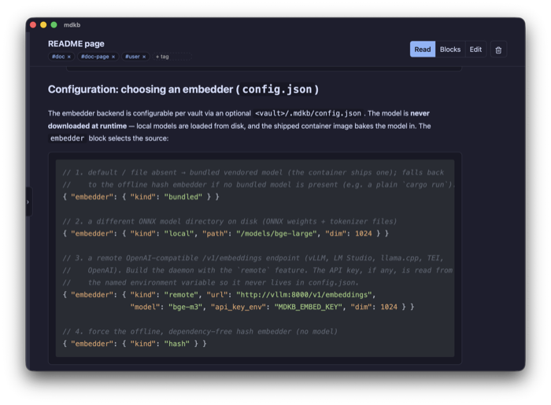
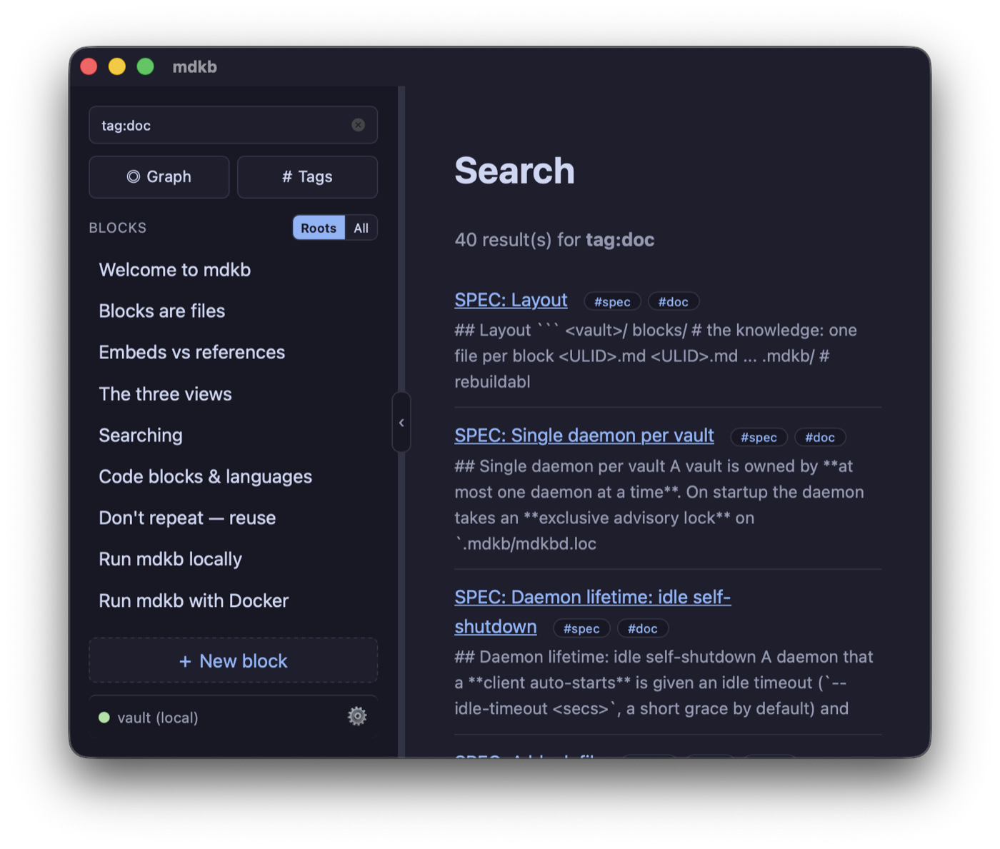

<!-- @generated by mkb from vault block 01KVKJ1RRAWZ98JYF6VZ3X7DKA (README page).
     Do not edit this file directly — edit the block in the vault and run `mkb export`. -->

# mkb — Modular Knowledge Base

mkb is a **modular Markdown knowledge base — a tool, not an agent** — that a human and an
AI use as equal partners. The inspiration: give an AI agent **auditable, refactorable
memory** — knowledge it stores and recalls that **you** can look up and manage too, in the
app, instead of an opaque store you can't see into.

Knowledge is a **block**: one Markdown file. Blocks *embed* others (`![[id]]`, a live copy) or
*link* to them (`[[id]]`), so a fact is written once, reused everywhere, and edited in one
place — memory that stays organized and refactorable as it grows, not a pile of near-duplicates.
Two equal consumers share one vault: **you** (desktop app or web UI) and **AI clients** (an MCP
server) — and it works fully with AI turned off. The Markdown files are the single source of truth;
the index is a rebuildable cache.

<p align="center">
  <a href="docs/images/app-read.png"></a>
</p>

> **Pre-release** (`0.1.0`). See [the design overview](docs/architecture.md) and the
> [on-disk format spec](docs/SPEC.md).

## Getting started

### Install

The fastest complete install is one command from a checkout, via
[`just`](https://github.com/casey/just) — it builds and installs the **whole product**: the
desktop app (also reachable in a browser via `mkb-web`), the CLI, and the MCP server.

```sh
just install        # everything: desktop app (+ mkb-web) + CLI + MCP server
```

Prefer not to build? Grab a **prebuilt release** (installer or portable archive) from the
**Releases** page or run it as a **container** — both detailed in the
[install guide](docs/INSTALL.md). (As a pre-release, published artifacts can lag behind `main`
or miss a platform; `just install` from a fresh checkout is the most reliable way to get the latest.)

Building from source needs Rust, [`just`](https://github.com/casey/just), and your platform's
webview build libraries — see [Installing the prerequisites](docs/PREREQS.md). Prebuilt releases
and the container need none of them.

### Choosing your vault

Point a client at a folder and go — `mkb search --vault ~/notes "…"` — or set a default once and
drop the flag (`mkb search "…"`). The resolution order and naming several vaults live in the
[configuration guide](docs/CONFIGURATION.md).

### Where your vault lives — local or synced

Your vault is just a directory of Markdown files, and **the Markdown is the only thing you ever
need to sync**. How you store it is independent of how you installed mkb.

- **Local (single machine).** Point a client at any folder (`--vault ~/notes`) and go. Nothing
  else to set up.
- **Synced across machines (OneDrive, Syncthing, Dropbox, iCloud…).** Put the vault folder inside
  your synced location and use it from each machine. Because the synced path is usually under your
  home directory, a `~`-relative vault entry in the registry (e.g. `~/OneDrive/notes`) resolves
  correctly everywhere, so one config can be shared.

This is safe because mkb's search index lives **outside** the vault, on each machine — so syncing
the Markdown never drags a live database between machines, and every machine rebuilds its own index
from the same notes. **Sync only the Markdown, never the index.** (If your sync tool leaves a
conflict copy, mkb won't index it — `mkb conflicts` surfaces it to merge in plain text.)

## Using mkb

### One vault, many interfaces

mkb is one knowledge base with several front-ends, and a full install gives you all of them — reach
for whichever fits the task.

| If you want to… | Use | What it is |
|---|---|---|
| Read, edit, and browse the graph | **Desktop app** | a Markdown editor + knowledge-graph browser |
| Reach your vault from a phone or another machine | **Web UI** — `mkb-web` | the same app, served in a browser |
| Script, search, or pipe from a terminal | **CLI** — `mkb` | `mkb search --vault ~/vault "how do I…"` |
| Give an AI assistant your notes | **MCP server** — `mkb-mcp` | a set of tools your MCP client calls |

Everything works with AI turned off; semantic search runs entirely on a local model (see the
[configuration guide](docs/CONFIGURATION.md)).

For a tour of the everyday features — searching, browsing and grouping, human-only blocks, and
exporting — see the [usage guide](docs/USAGE.md).

### Command line (`mkb`)

`mkb` is the terminal interface — script, search, and pipe against a vault:

```sh
mkb search "how do I restart nginx"   # hybrid keyword + semantic search
```

See the [usage guide](docs/USAGE.md) for the CLI in context, and `mkb --help` (or
`mkb <cmd> --help`) for the full command surface. From a source checkout, use
`cargo run -p mkb-cli -- …` in place of `mkb`.

### From an AI client (MCP)

Point any MCP client at the `mkb-mcp` server, giving it the vault to work on.

```jsonc
// example MCP client config entry
{
  "command": "mkb-mcp",
  "args": ["--vault", "/path/to/my-vault"]
}
```

### Desktop app

The desktop app is the human surface — a full **editor and graph browser** (Read / Blocks / Edit
modes, inline block editing, a `[[` link picker, a force-directed knowledge graph, and per-block
linked references). You and the AI co-manage one vault: toggle a block **🔒 human-only** and AI
clients can read it but never modify it. It opens a **local** vault or a **remote** one (`host:port`
+ token); manage vaults from **Settings**.

<table>
  <tr>
    <td align="center"><a href="docs/images/app-block-static.png"></a><br><sub>Blocks — embeds become live cards…</sub></td>
    <td align="center"><a href="docs/images/app-block-edit.png"></a><br><sub>…click any card to edit it inline</sub></td>
    <td align="center"><a href="docs/images/app-edit-picker.png"></a><br><sub>Edit — Markdown + the <code>[[</code> picker</sub></td>
  </tr>
  <tr>
    <td align="center"><a href="docs/images/app-graph.png"></a><br><sub>Graph — nodes sized by link degree</sub></td>
    <td align="center"><a href="docs/images/app-codeblocks.png"></a><br><sub>Code — syntax-highlighted blocks</sub></td>
    <td align="center"><a href="docs/images/app-tag-search.png"></a><br><sub>Search — tag &amp; language filters</sub></td>
  </tr>
</table>

Optional, advanced setup — choosing a different embedder and managing multiple vaults — lives in the [configuration guide](docs/CONFIGURATION.md).

## Deployment

See [deploy/README.md](deploy/README.md). In short: run `mkbd --vault <dir>` locally,
or deploy the daemon to k3s/Kubernetes as a single writer (`replicas: 1`) serving a
token-gated TCP API (`deploy/k8s.yaml`, `Dockerfile`). Sync only the Markdown vault across
machines; each daemon keeps its own local, rebuildable index.

### Skills to reference

Reference **skills** ship in [`docs/skills/`](./docs/skills/) — drop them into your AI agent as-is, or treat them as a starting point to fork and tailor to how *you* use mkb:

- **Using mkb well** — the DRY/transclusion principle, the search-before-write process, embed-vs-reference, and effective search patterns: [from an AI client (MCP)](docs/skills/mkb-knowledge/SKILL.md) · [from the CLI](docs/skills/mkb-cli/SKILL.md).
- **Keeping the graph clean** — the dedup & audit discipline that finds and repairs near-duplicates: [MCP](docs/skills/mkb-dedup-mcp/SKILL.md) · [CLI](docs/skills/mkb-dedup/SKILL.md).
- **Editing mkb's own docs** — the [docs-as-data workflow](docs/skills/mkb-docs-as-data/SKILL.md): edit the source block, then regenerate.

They're plain Markdown with simple frontmatter, so adapt the wording, trim a section, or compose them into a larger skill of your own — a foundation to build on, not a fixed contract.

## Development

Hacking on mkb? The workspace layout, the daemon/client internals, and the roadmap are in
[docs/CONTRIBUTING.md](docs/CONTRIBUTING.md); the mandatory working rules are in
[AGENTS.md](AGENTS.md), the design in [docs/architecture.md](docs/architecture.md),
and the on-disk format in [docs/SPEC.md](docs/SPEC.md).

## License

Dual-licensed under MIT or Apache-2.0.
