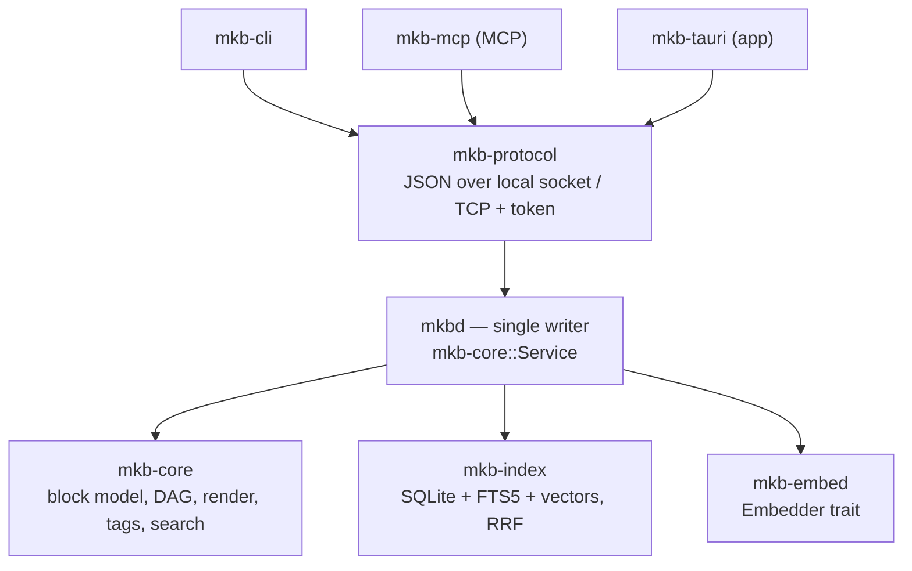

## Daemon & clients

```
        ┌───────────── thin clients (transport/presentation only) ─────────────┐
        │   mkb-cli          mkb-mcp (MCP)          mkb-tauri (app)         │
        └────────────────────────────────┬─────────────────────────────────────┘
                                         │  mkb-protocol (JSON over local socket / TCP+token)
                                ┌────────▼────────┐
                                │      mkbd      │  single writer: owns watcher + index + writes
                                │  mkb-core::Service (capability-gated dispatch)
                                └────────┬────────┘
                          ┌──────────────┼───────────────┐
                       mkb-core     mkb-index        mkb-embed
                    (block model,    (SQLite+FTS5+    (Embedder trait,
                     DAG, render,     vectors, RRF)    bundled/local/remote)
                     tags, search)
```

The same topology as a rendered diagram:



- **One daemon = one writer** over a vault. Local mode: a Unix socket (Windows named pipe),
  fail-closed (no network). Remote mode: TCP + shared token, capability-gated (default
  fail-closed).
- Clients **auto-start a detached daemon** for a local vault (it outlives the app) or connect to
  a remote one. Connection config is shared (`ConnectionConfig` / `connect` / `ensure_daemon` in
  `mkb-protocol`). The single-daemon-per-vault and idle-shutdown guarantees are below.
- **Presentation is shared** via `mkb-view` (Markdown→HTML, wikilink/embed decoration, XSS
  neutralization), so any current or future UI renders through the exact same path.
